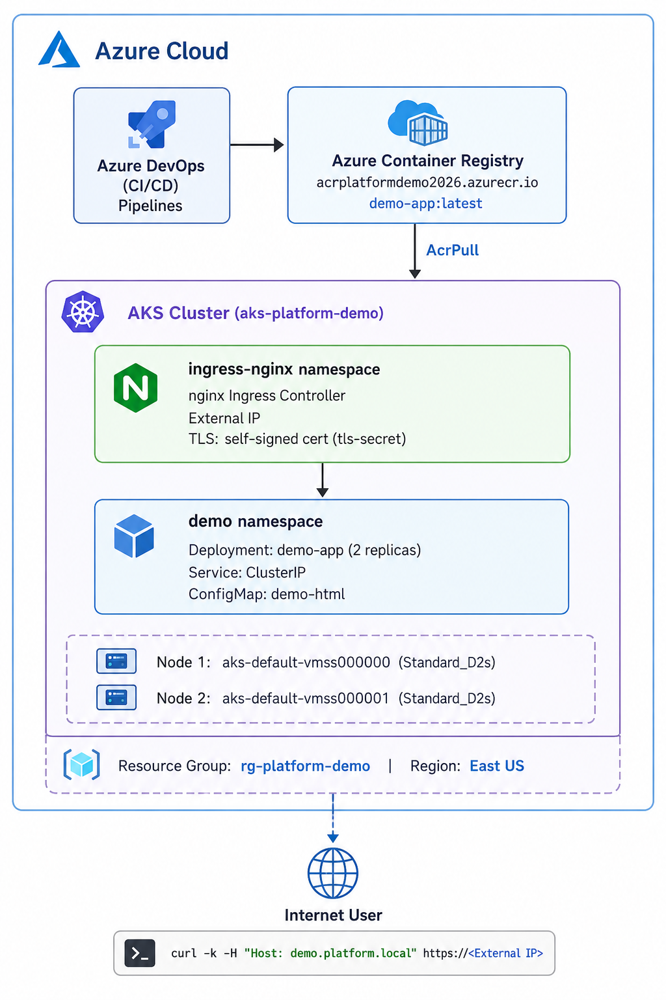

# AKS Platform Demo — Raj Kumar Prajapati

## Architecture
Azure DevOps → ACR → AKS → nginx Ingress (TLS) → Hello World App

## Components
- Azure Container Registry (ACR) — container image storage
- Azure Kubernetes Service (AKS) — managed Kubernetes cluster
- nginx Ingress Controller — with self-signed TLS certificate
- Azure DevOps CI/CD pipelines — build and deploy automation
- Terraform IaC — modular infrastructure provisioning

## Prerequisites
- Azure CLI >= 2.0
- Terraform >= 1.5.0
- kubectl
- Helm >= 3.0
- Docker / Azure ACR build

## Deploy Infrastructure
```bash
cd terraform
terraform init
terraform plan
terraform apply -auto-approve
```

## Connect to AKS
```bash
az aks get-credentials \
  --resource-group rg-platform-demo \
  --name aks-platform-demo
kubectl get nodes
```

## Deploy Application
```bash
# Generate TLS certificate
openssl req -x509 -nodes -days 365 -newkey rsa:2048 \
  -keyout tls.key -out tls.crt \
  -subj "/CN=demo.platform.local/O=platform-demo"

# Install nginx Ingress
helm repo add ingress-nginx https://kubernetes.github.io/ingress-nginx
helm install nginx-ingress ingress-nginx/ingress-nginx \
  --namespace ingress-nginx --create-namespace

# Apply manifests
kubectl apply -f k8s/
```

## Runtime Node Management
```bash
./scripts/start-nodes.sh       # Start cluster
./scripts/stop-nodes.sh        # Stop cluster
./scripts/scale-nodes.sh <n>   # Scale to n nodes
```

## Destroy All Resources
```bash
cd terraform
terraform destroy -auto-approve
```
<!-- demo run -->

## Architecture Diagram



## Infrastructure Components

| Component | Details |
|---|---|
| Resource Group | rg-platform-demo |
| Region | East US |
| ACR | acrplatformdemo2026.azurecr.io |
| AKS Cluster | aks-platform-demo |
| Node Size | 2x Standard_D2s_v7 |
| Kubernetes | v1.35.6 |
| Ingress | nginx Ingress Controller |
| TLS | Self-signed certificate (tls-secret) |
| App | demo-app:latest (2 replicas) |
